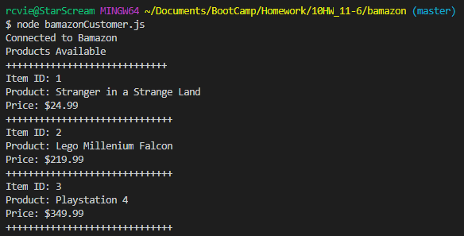
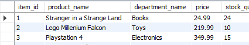
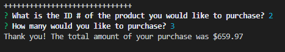
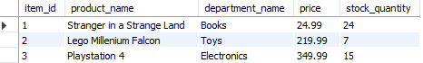
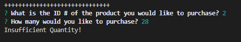

# bamazon

## Project Goals

1. Create a Node application that runs a storefront storing product information using MySQL.

2. Take in command line arguments that processes the customer's purchase.

4. Update product inventory in a MySQL Database.

5. Be as clean as possible with your code.

## Use CLI to Run Program

*Search Products*\
node bamazonCustomer.js

*Original Quantities in Database*

*Make a Purchase*\
Input Desired Product & Quantity in Command Line

*Update Quatity in Database*

*Insufficient Quantity*

